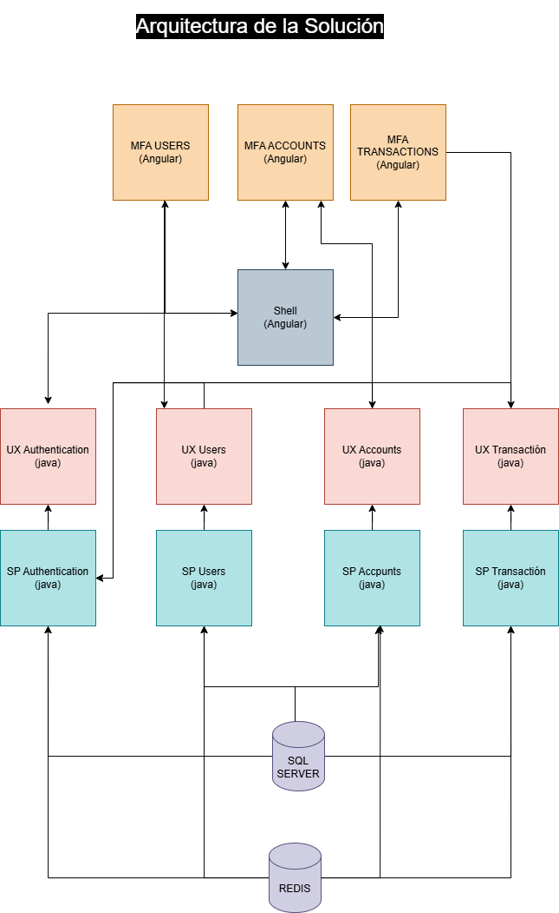
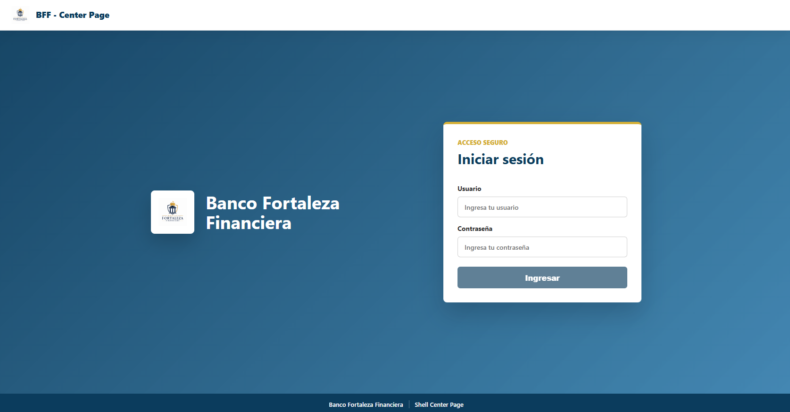
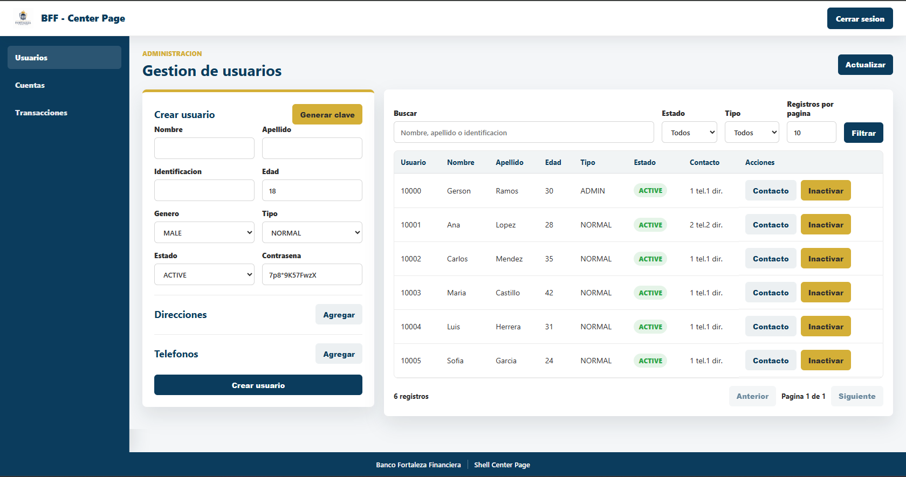
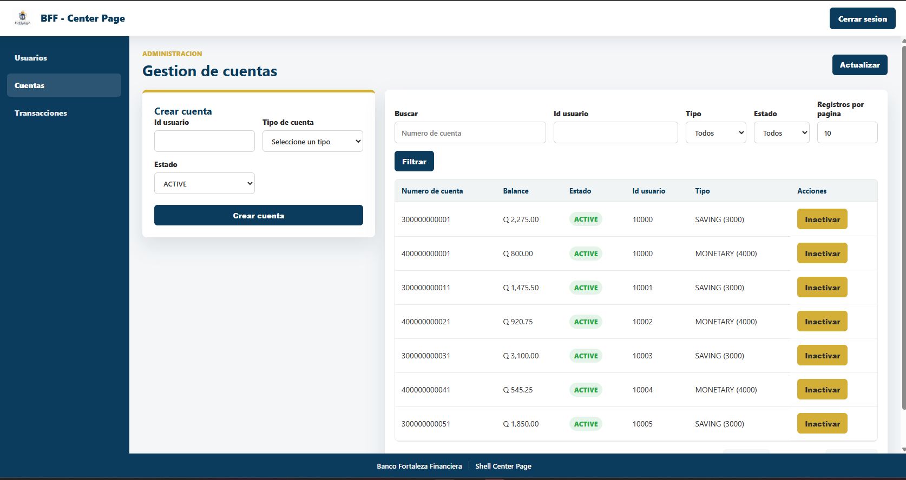
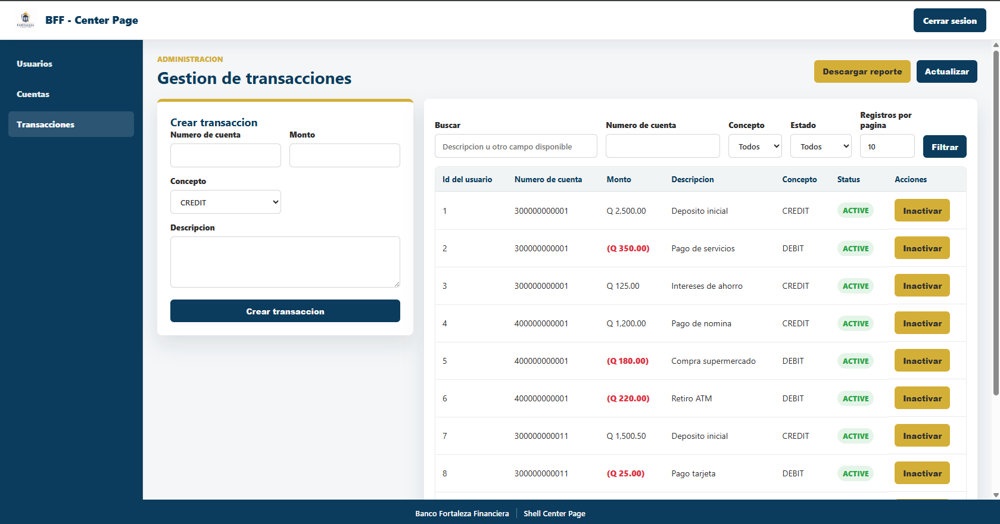
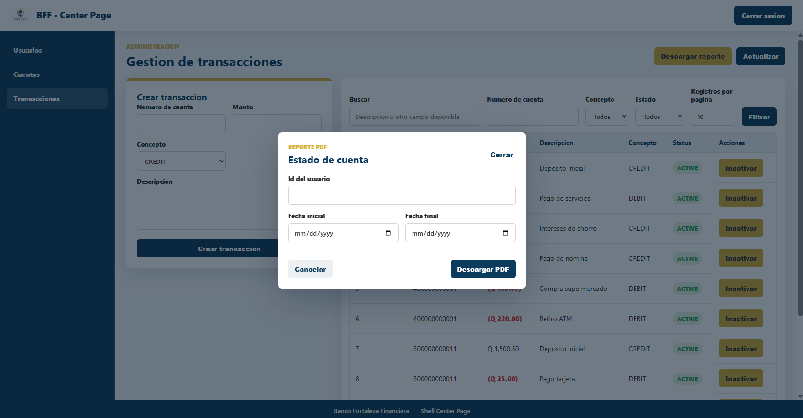

# Banco Fortaleza Financiera - Ambiente local

Este repositorio incluye scripts `.sh` para construir las imagenes Docker y levantar el ambiente local completo.

## Arquitectura



## Capturas de la aplicacion

### Login



### Gestion de usuarios



### Gestion de cuentas



### Gestion de transacciones



### Reporte de estado de cuenta



## Prerrequisitos

- Docker Desktop instalado y en ejecucion.
- Docker Compose disponible con el comando `docker compose`.
- Ejecutar los scripts desde una terminal compatible con Bash:
  - Linux/macOS
  - WSL en Windows
  - Git Bash en Windows

> Importante: los scripts deben ejecutarse desde la raiz del repositorio, porque usan `pwd` para resolver las rutas de `bff-cfg-scripts`.

Tambien es necesario que todos los proyectos esten dentro del mismo directorio raiz. Los scripts esperan encontrar en una misma carpeta las aplicaciones `bff-sp-*`, `bff-ux-*`, `bff-mfa-*`, `bff-shell-center-page` y `bff-cfg-scripts`. Si algun proyecto esta fuera de este directorio, el proceso de construccion o despliegue no encontrara las rutas necesarias.

Ejemplo de estructura esperada:

```text
Banco-Fortaleza-Financiera/
|-- bff-cfg-scripts/
|-- bff-shell-center-page/
|-- bff-mfa-accounts/
|-- bff-mfa-transactions/
|-- bff-mfa-users/
|-- bff-sp-accounts/
|-- bff-sp-authentication/
|-- bff-sp-transactions/
|-- bff-sp-users/
|-- bff-ux-accounts/
|-- bff-ux-authentication/
|-- bff-ux-transactions/
|-- bff-ux-users/
|-- init.sh
|-- generate_images.sh
|-- deploy_database.sh
`-- deploy_services.sh
```

## Scripts disponibles

| Script | Descripcion |
| --- | --- |
| `init.sh` | Ejecuta el flujo completo: genera imagenes, levanta base de datos/Redis y levanta servicios. |
| `generate_images.sh` | Construye las imagenes Docker locales de los servicios SP, UX, MFA y shell. |
| `deploy_database.sh` | Levanta SQL Server y Redis usando Docker Compose. |
| `deploy_services.sh` | Levanta los servicios BFF Java, MFA y shell usando Docker Compose. |

Los mismos scripts tambien existen en `bff-cfg-scripts/bash`, pero se recomienda usar los de la raiz del repositorio para evitar problemas de rutas.

## Credenciales de prueba

Para ingresar al ambiente local puedes usar el siguiente usuario y contrasena:

| Campo | Valor |
| --- | --- |
| `idUser` | `10000` |
| `password` | `Str0ngP@ssword` |

## Ejecucion completa del ambiente

Desde la raiz del repositorio:

```bash
sh init.sh
```

Este comando ejecuta internamente:

```bash
sh generate_images.sh
sh deploy_database.sh
sh deploy_services.sh
```

## Ejecucion por pasos

Si necesitas levantar el ambiente manualmente o repetir solo una parte del proceso, usa este orden:

### 1. Construir imagenes Docker

```bash
sh generate_images.sh
```

Este script construye imagenes locales como:

- `bff-sp-authentication:local`
- `bff-ux-authentication:local`
- `bff-sp-users:local`
- `bff-ux-users:local`
- `bff-sp-accounts:local`
- `bff-ux-accounts:local`
- `bff-sp-transactions:local`
- `bff-ux-transactions:local`
- `bff-shell-center-page:local`
- `bff-mfa-users:local`
- `bff-mfa-accounts:local`
- `bff-mfa-transactions:local`

### 2. Levantar base de datos y Redis

```bash
sh deploy_database.sh
```

Este script levanta:

- SQL Server: `127.0.0.1:14330`
- Redis: `localhost:6379`
- Redis Commander: `http://localhost:9500`

La configuracion se encuentra en:

- `bff-cfg-scripts/docker/bdd/.env`
- `bff-cfg-scripts/docker/redis/.env`

### 3. Levantar servicios BFF y frontend

```bash
sh deploy_services.sh
```

Este script levanta:

- Authentication UX: `http://localhost:8080`
- Users UX: `http://localhost:8081`
- Accounts UX: `http://localhost:8082`
- Transactions UX: `http://localhost:8083`
- Shell Center Page: `http://localhost:4200`

Para ver la pagina principal del ambiente debes ingresar en el navegador a:

```text
http://localhost:4200
```

## Validar contenedores

Para revisar que los contenedores esten arriba:

```bash
docker ps
```

Para ver todos los contenedores, incluidos los detenidos:

```bash
docker ps -a
```

Para revisar logs de un servicio especifico:

```bash
docker logs -f nombre-del-contenedor
```

Ejemplo:

```bash
docker logs -f bff-shell-center-page
```

## Detener el ambiente

Como los servicios se levantan con varios archivos Docker Compose, puedes detenerlos por grupo.

### Base de datos

```bash
docker compose --env-file bff-cfg-scripts/docker/bdd/.env -f bff-cfg-scripts/docker/bdd/bdd-sql-server.yml down
```

### Redis

```bash
docker compose --env-file bff-cfg-scripts/docker/redis/.env -f bff-cfg-scripts/docker/redis/redis-server.yml down
```

### Servicios Java

```bash
docker compose -f bff-cfg-scripts/docker/java/bff-authentication/bff-authentication-server.yml down
docker compose -f bff-cfg-scripts/docker/java/bff-users/bff-users-server.yml down
docker compose -f bff-cfg-scripts/docker/java/bff-accounts/bff-accounts-server.yml down
docker compose -f bff-cfg-scripts/docker/java/bff-transactions/bff-transactions-server.yml down
```

### Shell y MFA

```bash
docker compose -f bff-cfg-scripts/docker/angular/docker-compose.yml down
```

## Problemas comunes

### `docker: command not found`

Docker no esta instalado, no esta en el `PATH`, o Docker Desktop no esta iniciado.

### `docker compose` no existe

Verifica que tu version de Docker soporte Docker Compose v2. El comando esperado por los scripts es:

```bash
docker compose version
```

### Error de rutas al ejecutar scripts

Asegurate de estar en la raiz del repositorio antes de ejecutar:

```bash
pwd
```

Debe apuntar a la carpeta `Banco-Fortaleza-Financiera`.

### Puerto ocupado

Si algun puerto ya esta en uso, revisa el proceso o contenedor que lo esta ocupando:

```bash
docker ps
```

Puertos usados por defecto:

- `14330`: SQL Server
- `6379`: Redis
- `9500`: Redis Commander
- `8080`: Authentication UX
- `8081`: Users UX
- `8082`: Accounts UX
- `8083`: Transactions UX
- `4200`: Shell Center Page

### Coleccion del postman
Se encuentra una coleccion de postman para realizar pruebas a las apis (docs/Banco-Fortaleza-Financiera.postman_collection.json)

la version de postman que se uso es: 12.9.0